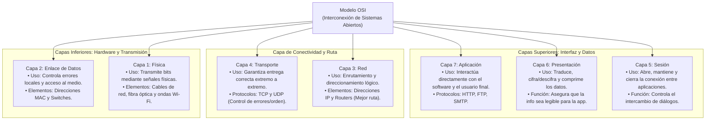
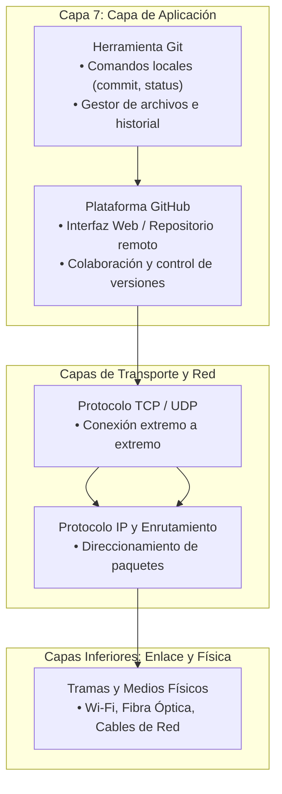

# Miguelmontealegre-Juandavidespitialeon
## 1:
en el siguiente codigo simula dos servidores independientes ( A y B ) que actúan como una red descentralizada básica. Cada mensaje enviado se "empaqueta" en un bloque conectado por SHA-256. Cuando el servidor A recibe un mensaje, crea el bloque y le copia inmediatamente al servidor B para mantenerlos con la misma informacion

```
import hashlib
import time
import json
from flask import Flask, request, jsonify
import threading
import requests

# --- 1. CLASE BLOCKCHAIN ---
class Blockchain:
    def __init__(self):
        self.chain = []
        # Crear el bloque génesis (primer bloque)
        self.create_block(data="Bloque Genesis (Inicio)", previous_hash="0")

    def create_block(self, data, previous_hash):
        """¿Cómo se crea un bloque? Se agrupan los datos, el timestamp, 
           el hash anterior y se calcula un nuevo hash SHA-256."""
        block = {
            'index': len(self.chain) + 1,
            'timestamp': time.time(),
            'data': data,
            'previous_hash': previous_hash
        }
        block['hash'] = self.hash_block(block)
        self.chain.append(block)
        return block

    def hash_block(self, block):
        # Genera la huella digital criptográfica (SHA-256) del bloque
        block_string = json.dumps(block, sort_keys=True).encode()
        return hashlib.sha256(block_string).hexdigest()

    def get_last_block(self):
        return self.chain[-1]

    def add_block_externally(self, block):
        # Valida que el bloque encaje con la cadena actual antes de aceptarlo
        last_block = self.get_last_block()
        if last_block['hash'] == block['previous_hash']:
            self.chain.append(block)
            return True
        return False

# --- 2. CONFIGURACIÓN DE LOS SERVIDORES (NODO A y NODO B) ---
app_a = Flask("Servidor_A")
app_b = Flask("Servidor_B")

blockchain_a = Blockchain()
blockchain_b = Blockchain()

# Ruta para enviar mensaje al Servidor A
@app_a.route('/enviar', methods=['POST'])
def enviar_a():
    mensaje = request.json.get('mensaje')
    last_block = blockchain_a.get_last_block()
    nuevo_bloque = blockchain_a.create_block(mensaje, last_block['hash'])
    
    # Sincronizar automáticamente con el Servidor B
    try:
        requests.post('http://localhost:5001/recibir', json=nuevo_bloque)
    except:
        pass
        
    return jsonify({"status": "Mensaje guardado en A y propagado", "bloque": nuevo_bloque}), 201

@app_a.route('/cadena', methods=['GET'])
def cadena_a():
    return jsonify(blockchain_a.chain)

# Ruta para recibir el bloque en el Servidor B
@app_b.route('/recibir', methods=['POST'])
def recibir_b():
    bloque = request.json
    exito = blockchain_b.add_block_externally(bloque)
    if exito:
        return jsonify({"status": "Bloque aceptado por B"}), 201
    return jsonify({"status": "Rechazado"}), 400

@app_b.route('/cadena', methods=['GET'])
def cadena_b():
    return jsonify(blockchain_b.chain)

# --- 3. EJECUCIÓN SIMULADA ---
if __name__ == '__main__':
    # Levantar servidores en hilos separados
    threading.Thread(target=lambda: app_a.run(port=5000, debug=False, use_reloader=False), daemon=True).start()
    threading.Thread(target=lambda: app_b.run(port=5001, debug=False, use_reloader=False), daemon=True).start()
    
    time.sleep(1) # Esperar arranque

    # Prueba de envío
    print("Enviando mensaje...")
    requests.post('http://localhost:5000/enviar', json={"mensaje": "Hola mundo por Blockchain"})

    # Ver cadenas
    print("\nCadena Servidor A:")
    print(requests.get('http://localhost:5000/cadena').json())

    print("\nCadena Servidor B (Sincronizada):")
    print(requests.get('http://localhost:5001/cadena').json())
```
---
##  ¿Cómo se crea un bloque?

crear un bloque es empaquetar la nueva información junto con el rastro del bloque anterior y sellarlo con una firma criptográfica (SHA-256) para que nadie lo pueda alterar sin que se note como en palabras mas sencillas es como escribir una receta y la primera pagina ponerle (5) y la siguiente hoja iniciarla con ese digito o caracter y asi sucesivamente con cada pagina

---

## ¿Qué tipo de encriptación se maneja en blockchain? Y ¿Cómo funciona?

En blockchain hay mas de un tipo de encriptacion, las cuales son: funciones hash criptograficas que funciona convirtiendo cualquier informacion en una formula matematica compleja con cierta cantidad de caracteres fijas y criptograficas de clave publica y privada en la que se generan dos llaves matematicas conectadas entre si para verificar nuestra identidad y asegurar los mensajes

---
## ¿Cómo sería el funcionamiento de una cadena de bloques en la transacción bancaria?

una transacción bancaria con blockchain practicamente funciona como un libro de contabilidad digital compartido y ultra seguro entre varios bancos , donde nadie puede borrar ni modificar lo que ya se escribió

---
## ¿Cómo se comporta blockchain ante la computación cuántica?

es una amenaza latente porque estas computadoras cuanticas podrian decifrar con relativa facilidad nuestras claves por ejemplo las claves privadas a partir de nuestra clave publica y aunque el sha-256 se salva un poco ms igualmente no esta para nada protgido contra estas computadoras las cuales con la guia correcta podrian llegar a decifrarlas o reducir drasticamente su efectividad, ya se estan trabajando contra medidas conocidas como "post-cuantica" para que no colapse todo el sistema

---

## ¿Qué es la computación cuántica? Y ¿Qué tipo de seguridad utiliza?.

la computacion cuantica es la superposicion del codigo binario que utilizamos en las computadoras normales es decir en lugar de leer 0 y 1 u no por uno los lee al mismo tiempo, digamos tenemos una biblioteca infinita, a una computadora normal le preguntamos algo y va a leer todos los libros uno por uno en cambio una computadora cuantica lee toda la biblioteca al mismo tiempo 

la seguridad que utiliza no es una tradional que suelen ser formulas matematicas complejas o contraseñas, la seguridad que utiliza son conceptos fisicos:
1. El principio de medición(cuando se observa una particula cambia su estado imposibilitando que un hacker pueda acceder si la observa) y 2. Detección instantánea de espías (como la Como la información viaja en fotones, cualquier manipulación externa destruye o altera los datos.)

| Tipo de Seguridad / Tecnología | ¿En qué se basa? | ¿Cómo funciona? | ¿Para qué sirve? |
| :--- | :--- | :--- | :--- |
| **Funciones Hash Criptográficas** *(Ej. SHA-256)* | Matemáticas y compresión de datos | Convierte cualquier información en una fórmula matemática compleja con una cantidad fija de caracteres (un hash único). | Sellar y unir los bloques de una cadena; detectar al instante si alguien alteró un mensaje. |
| **Criptografía de Clave Pública / Privada** | Matemáticas y pares de llaves | Genera dos llaves conectadas entre sí: una privada (secreta para firmar) y una pública (visible para verificar). | Verificar la identidad de los usuarios y asegurar que los mensajes o transacciones sean legítimos. |
| **Distribución de Claves Cuánticas (QKD)** *(Seguridad Cuántica)* | Física cuántica y principios de la luz | Utiliza fotones y el principio de medición: si un hacker intenta observar o espiar la información, altera su estado físico y destruye los datos. | Ofrecer una seguridad inviolable en las redes del futuro, detectando espías de forma instantánea sin depender de contraseñas. |

---


https://canva.link/d3gwdsp0a5uw8ji

---

# 2
Capa Física:

Qué hace: Se encarga de los aspectos puramente físicos y eléctricos. Transmite los bits de información en forma de señales eléctricas (cables de red), ondas de radio (Wi-Fi) o pulsos de luz (fibra óptica).

Capa de Enlace de Datos:

Qué hace: Organiza los bits en paquetes llamados tramas, controla el acceso al medio físico y corrige errores básicos que puedan ocurrir en el cable o conexión directa entre dos dispositivos vecinos (aquí operan las direcciones MAC y los switches).

Capa de Red:

Qué hace: Se encarga del direccionamiento y el enrutamiento. Busca el mejor camino posible para que los datos viajen desde el dispositivo de origen hasta el destino a través de múltiples redes conectadas (aquí operan las direcciones IP y los routers).

Capa de Transporte:

Qué hace: Garantiza que los datos lleguen de forma correcta, ordenada y sin pérdidas de extremo a extremo. Divide los mensajes grandes en paquetes más pequeños y verifica si llegaron bien (aquí destacan protocolos como TCP y UDP).

Capa de Sesión:

Qué hace: Abre, mantiene y cierra la conexión o sesión de comunicación entre dos aplicaciones en dispositivos distintos, asegurando que se mantenga activa mientras dura el intercambio.

Capa de Presentación:

Qué hace: Se encarga de la traducción de los datos. Traduce el formato de la información para que la aplicación pueda entenderla, aplicando también funciones de cifrado/descifrado (seguridad) y compresión de archivos.

Capa de Aplicación:

Qué hace: Es la capa más cercana al usuario final. Es la que interactúa directamente con el software que utilizas (como tu navegador web, el cliente de correo electrónico o aplicaciones de chat) mediante protocolos como HTTP, FTP o SMTP.

# Mapa Conceptual del Modelo OSI


---
## ¿La herramienta Github y la herramienta Git en qué parte del modelo OSI estaría?.
cumplen varias cosas de varias capas pero estarian en la capa 7 porque son herramientas de sotware que interactuan con omandos locales en la terminal y funciona como gestor de archivos


## ¿En su colegio cómo se visualiza el modelo OSI y el enfoque de ciberseguridad?, ¿Qué elementos describes de tu
entorno? Y ¿cómo se maneja el tema de criptografía?

pues con total sinceridad no es algo que se revise constantemente, de hecho en lo personal nunca me lo han enseñado en clase, practicamente es lo mismo que me enseñaron en mi hogar, y si se llega a visualizar es por un tecnico que viene a reparar alguna falla masiva, pero es muy poco frecuente

---

Los estudiantes de compensar son desarrolladores que trabajan en un proyecto alojado en GitHub y precisamente
acaban de finalizar una nueva funcionalidad en la máquina local y proceden a ejecutar los siguientes comandos para
subir los cambios al repositorio remoto:


##1 capa del modelo OSI involucrada principalmente en esa acción.

se utiliza la capa 7 porque interactuar con el sotware y el usuario y la capa 3 para verificar el alcance 

##2 Los protocolos y estructuras de datos (tramas, paquetes, segmentos) que
intervienen
* **Ethernet** (Capa 2)
* **IP (IPv4 / IPv6)** (Capa 3)
* **ICMP** (Capa 3)
* **TCP** (Capa 4)
* **UDP** (Capa 4)
* **DNS** (Capa 7)
* **TLS / SSL** (Capas 5 y 6)
* **HTTP / HTTPS** (Capa 7)
* **Git Smart Protocol** (Capa 7)

#### Estructuras de datos
* **Tramas** (Capa de Enlace / Capa 2)
* **Paquetes / Datagramas** (Capa de Red / Capa 3)
* **Segmentos** (TCP) y **Datagramas** (UDP) (Capa de Transporte / Capa 4)
* **Mensajes / Objetos de Aplicación** (peticiones/respuestas HTTP, consultas DNS y archivos *packfile* de Git en la Capa de Aplicación / Capa 7)

##3 qué comando(s) de red podrían
utilizar para verificar o diagnosticar problemas en ese paso específico.

### Comandos de red y herramientas de diagnóstico para Git Push

#### 1. Verificación de Resolución de Nombres (DNS)
* **`nslookup github.com`**: Permite consultar al servidor DNS configurado para verificar si traduce correctamente el dominio de GitHub a su dirección IP correspondiente.

#### 2. Verificación de Conectividad General y Red (Capa 3 / ICMP)
* **`ping github.com`**: Envía paquetes ICMP Echo Request para medir la latencia y la pérdida de paquetes hacia el servidor de GitHub.
* **`tracert github.com`** o **`pathping github.com`**: Muestran la ruta exacta (saltos de los routers intermedios) que siguen los paquetes hasta llegar a los servidores de GitHub, útil para identificar en qué nodo de la red se producen cortes o retrasos.

#### 3. Verificación de Conexiones Activas y Puertos (Capa 4 / TCP)
* **`netstat -ano`** o **`netstat -b`**: Muestran las conexiones de red activas y los puertos en uso en tu máquina para revisar si el proceso mantiene una conexión establecida (`ESTABLISHED`) en el puerto estándar de HTTPS (`443`).

#### 4. Diagnóstico Avanzado con Filtros de Wireshark
* **`dns`**: Filtro para visualizar únicamente las peticiones y respuestas de resolución de nombres.
* **`tcp.port == 443`** o **`tls`**: Filtra todo el tráfico cifrado de HTTPS, permitiéndote ver el intercambio del *TCP Handshake*, la negociación de seguridad (TLS) y los paquetes transmitidos durante el `git push`.

##4 Relacionar los conceptos de teletráfico (latencia, pérdida de paquetes, throughput) con
el éxito o fracaso de la operación (Investigar los conceptos).


