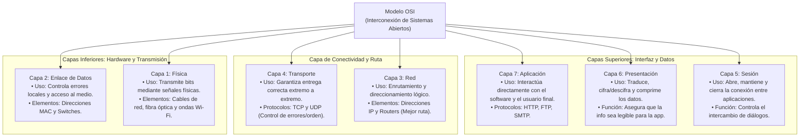
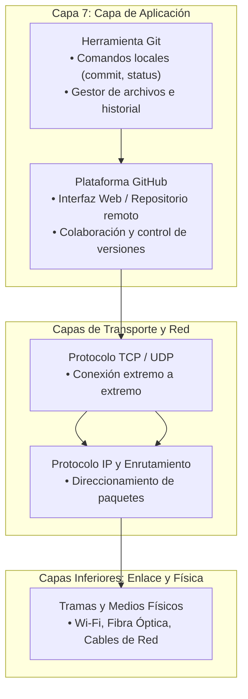

# Miguelmontealegre-Juandavidespitialeon
## 1:
en el siguiente codigo simula dos servidores independientes ( A y B ) que actúan como una red descentralizada básica. Cada mensaje enviado se "empaqueta" en un bloque conectado por SHA-256. Cuando el servidor A recibe un mensaje, crea el bloque y le copia inmediatamente al servidor B para mantenerlos con la misma informacion

```
import hashlib
import time
import json
from flask import Flask, request, jsonify
import threading
import requests

# --- 1. CLASE BLOCKCHAIN ---
class Blockchain:
    def __init__(self):
        self.chain = []
        # Crear el bloque génesis (primer bloque)
        self.create_block(data="Bloque Genesis (Inicio)", previous_hash="0")

    def create_block(self, data, previous_hash):
        """¿Cómo se crea un bloque? Se agrupan los datos, el timestamp, 
           el hash anterior y se calcula un nuevo hash SHA-256."""
        block = {
            'index': len(self.chain) + 1,
            'timestamp': time.time(),
            'data': data,
            'previous_hash': previous_hash
        }
        block['hash'] = self.hash_block(block)
        self.chain.append(block)
        return block

    def hash_block(self, block):
        # Genera la huella digital criptográfica (SHA-256) del bloque
        block_string = json.dumps(block, sort_keys=True).encode()
        return hashlib.sha256(block_string).hexdigest()

    def get_last_block(self):
        return self.chain[-1]

    def add_block_externally(self, block):
        # Valida que el bloque encaje con la cadena actual antes de aceptarlo
        last_block = self.get_last_block()
        if last_block['hash'] == block['previous_hash']:
            self.chain.append(block)
            return True
        return False

# --- 2. CONFIGURACIÓN DE LOS SERVIDORES (NODO A y NODO B) ---
app_a = Flask("Servidor_A")
app_b = Flask("Servidor_B")

blockchain_a = Blockchain()
blockchain_b = Blockchain()

# Ruta para enviar mensaje al Servidor A
@app_a.route('/enviar', methods=['POST'])
def enviar_a():
    mensaje = request.json.get('mensaje')
    last_block = blockchain_a.get_last_block()
    nuevo_bloque = blockchain_a.create_block(mensaje, last_block['hash'])
    
    # Sincronizar automáticamente con el Servidor B
    try:
        requests.post('http://localhost:5001/recibir', json=nuevo_bloque)
    except:
        pass
        
    return jsonify({"status": "Mensaje guardado en A y propagado", "bloque": nuevo_bloque}), 201

@app_a.route('/cadena', methods=['GET'])
def cadena_a():
    return jsonify(blockchain_a.chain)

# Ruta para recibir el bloque en el Servidor B
@app_b.route('/recibir', methods=['POST'])
def recibir_b():
    bloque = request.json
    exito = blockchain_b.add_block_externally(bloque)
    if exito:
        return jsonify({"status": "Bloque aceptado por B"}), 201
    return jsonify({"status": "Rechazado"}), 400

@app_b.route('/cadena', methods=['GET'])
def cadena_b():
    return jsonify(blockchain_b.chain)

# --- 3. EJECUCIÓN SIMULADA ---
if __name__ == '__main__':
    # Levantar servidores en hilos separados
    threading.Thread(target=lambda: app_a.run(port=5000, debug=False, use_reloader=False), daemon=True).start()
    threading.Thread(target=lambda: app_b.run(port=5001, debug=False, use_reloader=False), daemon=True).start()
    
    time.sleep(1) # Esperar arranque

    # Prueba de envío
    print("Enviando mensaje...")
    requests.post('http://localhost:5000/enviar', json={"mensaje": "Hola mundo por Blockchain"})

    # Ver cadenas
    print("\nCadena Servidor A:")
    print(requests.get('http://localhost:5000/cadena').json())

    print("\nCadena Servidor B (Sincronizada):")
    print(requests.get('http://localhost:5001/cadena').json())
```
---
##  ¿Cómo se crea un bloque?

crear un bloque es empaquetar la nueva información junto con el rastro del bloque anterior y sellarlo con una firma criptográfica (SHA-256) para que nadie lo pueda alterar sin que se note como en palabras mas sencillas es como escribir una receta y la primera pagina ponerle (5) y la siguiente hoja iniciarla con ese digito o caracter y asi sucesivamente con cada pagina

---

## ¿Qué tipo de encriptación se maneja en blockchain? Y ¿Cómo funciona?

En blockchain hay mas de un tipo de encriptacion, las cuales son: funciones hash criptograficas que funciona convirtiendo cualquier informacion en una formula matematica compleja con cierta cantidad de caracteres fijas y criptograficas de clave publica y privada en la que se generan dos llaves matematicas conectadas entre si para verificar nuestra identidad y asegurar los mensajes

---
## ¿Cómo sería el funcionamiento de una cadena de bloques en la transacción bancaria?

una transacción bancaria con blockchain practicamente funciona como un libro de contabilidad digital compartido y ultra seguro entre varios bancos , donde nadie puede borrar ni modificar lo que ya se escribió

---
## ¿Cómo se comporta blockchain ante la computación cuántica?

es una amenaza latente porque estas computadoras cuanticas podrian decifrar con relativa facilidad nuestras claves por ejemplo las claves privadas a partir de nuestra clave publica y aunque el sha-256 se salva un poco ms igualmente no esta para nada protgido contra estas computadoras las cuales con la guia correcta podrian llegar a decifrarlas o reducir drasticamente su efectividad, ya se estan trabajando contra medidas conocidas como "post-cuantica" para que no colapse todo el sistema

---

## ¿Qué es la computación cuántica? Y ¿Qué tipo de seguridad utiliza?.

la computacion cuantica es la superposicion del codigo binario que utilizamos en las computadoras normales es decir en lugar de leer 0 y 1 u no por uno los lee al mismo tiempo, digamos tenemos una biblioteca infinita, a una computadora normal le preguntamos algo y va a leer todos los libros uno por uno en cambio una computadora cuantica lee toda la biblioteca al mismo tiempo 

la seguridad que utiliza no es una tradional que suelen ser formulas matematicas complejas o contraseñas, la seguridad que utiliza son conceptos fisicos:
1. El principio de medición(cuando se observa una particula cambia su estado imposibilitando que un hacker pueda acceder si la observa) y 2. Detección instantánea de espías (como la Como la información viaja en fotones, cualquier manipulación externa destruye o altera los datos.)

| Tipo de Seguridad / Tecnología | ¿En qué se basa? | ¿Cómo funciona? | ¿Para qué sirve? |
| :--- | :--- | :--- | :--- |
| **Funciones Hash Criptográficas** *(Ej. SHA-256)* | Matemáticas y compresión de datos | Convierte cualquier información en una fórmula matemática compleja con una cantidad fija de caracteres (un hash único). | Sellar y unir los bloques de una cadena; detectar al instante si alguien alteró un mensaje. |
| **Criptografía de Clave Pública / Privada** | Matemáticas y pares de llaves | Genera dos llaves conectadas entre sí: una privada (secreta para firmar) y una pública (visible para verificar). | Verificar la identidad de los usuarios y asegurar que los mensajes o transacciones sean legítimos. |
| **Distribución de Claves Cuánticas (QKD)** *(Seguridad Cuántica)* | Física cuántica y principios de la luz | Utiliza fotones y el principio de medición: si un hacker intenta observar o espiar la información, altera su estado físico y destruye los datos. | Ofrecer una seguridad inviolable en las redes del futuro, detectando espías de forma instantánea sin depender de contraseñas. |

---


https://canva.link/d3gwdsp0a5uw8ji

---

# 2
Capa Física:

Qué hace: Se encarga de los aspectos puramente físicos y eléctricos. Transmite los bits de información en forma de señales eléctricas (cables de red), ondas de radio (Wi-Fi) o pulsos de luz (fibra óptica).

Capa de Enlace de Datos:

Qué hace: Organiza los bits en paquetes llamados tramas, controla el acceso al medio físico y corrige errores básicos que puedan ocurrir en el cable o conexión directa entre dos dispositivos vecinos (aquí operan las direcciones MAC y los switches).

Capa de Red:

Qué hace: Se encarga del direccionamiento y el enrutamiento. Busca el mejor camino posible para que los datos viajen desde el dispositivo de origen hasta el destino a través de múltiples redes conectadas (aquí operan las direcciones IP y los routers).

Capa de Transporte:

Qué hace: Garantiza que los datos lleguen de forma correcta, ordenada y sin pérdidas de extremo a extremo. Divide los mensajes grandes en paquetes más pequeños y verifica si llegaron bien (aquí destacan protocolos como TCP y UDP).

Capa de Sesión:

Qué hace: Abre, mantiene y cierra la conexión o sesión de comunicación entre dos aplicaciones en dispositivos distintos, asegurando que se mantenga activa mientras dura el intercambio.

Capa de Presentación:

Qué hace: Se encarga de la traducción de los datos. Traduce el formato de la información para que la aplicación pueda entenderla, aplicando también funciones de cifrado/descifrado (seguridad) y compresión de archivos.

Capa de Aplicación:

Qué hace: Es la capa más cercana al usuario final. Es la que interactúa directamente con el software que utilizas (como tu navegador web, el cliente de correo electrónico o aplicaciones de chat) mediante protocolos como HTTP, FTP o SMTP.

# Mapa Conceptual del Modelo OSI


---
## ¿La herramienta Github y la herramienta Git en qué parte del modelo OSI estaría?.
cumplen varias cosas de varias capas pero estarian en la capa 7 porque son herramientas de sotware que interactuan con omandos locales en la terminal y funciona como gestor de archivos


## ¿En su colegio cómo se visualiza el modelo OSI y el enfoque de ciberseguridad?, ¿Qué elementos describes de tu
entorno? Y ¿cómo se maneja el tema de criptografía?

pues con total sinceridad no es algo que se revise constantemente, de hecho en lo personal nunca me lo han enseñado en clase, practicamente es lo mismo que me enseñaron en mi hogar, y si se llega a visualizar es por un tecnico que viene a reparar alguna falla masiva, pero es muy poco frecuente

---

Los estudiantes de compensar son desarrolladores que trabajan en un proyecto alojado en GitHub y precisamente
acaban de finalizar una nueva funcionalidad en la máquina local y proceden a ejecutar los siguientes comandos para
subir los cambios al repositorio remoto:


## 1 capa del modelo OSI involucrada principalmente en esa acción.

se utiliza la capa 7 porque interactuar con el sotware y el usuario y la capa 3 para verificar el alcance 

## 2 Los protocolos y estructuras de datos (tramas, paquetes, segmentos) que
intervienen
* **Ethernet** (Capa 2)
* **IP (IPv4 / IPv6)** (Capa 3)
* **ICMP** (Capa 3)
* **TCP** (Capa 4)
* **UDP** (Capa 4)
* **DNS** (Capa 7)
* **TLS / SSL** (Capas 5 y 6)
* **HTTP / HTTPS** (Capa 7)
* **Git Smart Protocol** (Capa 7)

#### Estructuras de datos
* **Tramas** (Capa de Enlace / Capa 2)
* **Paquetes / Datagramas** (Capa de Red / Capa 3)
* **Segmentos** (TCP) y **Datagramas** (UDP) (Capa de Transporte / Capa 4)
* **Mensajes / Objetos de Aplicación** (peticiones/respuestas HTTP, consultas DNS y archivos *packfile* de Git en la Capa de Aplicación / Capa 7)

## 3 qué comando(s) de red podrían utilizar para verificar o diagnosticar problemas en ese paso específico.

### Comandos de red y herramientas de diagnóstico para Git Push

#### 1. Verificación de Resolución de Nombres (DNS)
* **`nslookup github.com`**: Permite consultar al servidor DNS configurado para verificar si traduce correctamente el dominio de GitHub a su dirección IP correspondiente.

#### 2. Verificación de Conectividad General y Red (Capa 3 / ICMP)
* **`ping github.com`**: Envía paquetes ICMP Echo Request para medir la latencia y la pérdida de paquetes hacia el servidor de GitHub.
* **`tracert github.com`** o **`pathping github.com`**: Muestran la ruta exacta (saltos de los routers intermedios) que siguen los paquetes hasta llegar a los servidores de GitHub, útil para identificar en qué nodo de la red se producen cortes o retrasos.

#### 3. Verificación de Conexiones Activas y Puertos (Capa 4 / TCP)
* **`netstat -ano`** o **`netstat -b`**: Muestran las conexiones de red activas y los puertos en uso en tu máquina para revisar si el proceso mantiene una conexión establecida (`ESTABLISHED`) en el puerto estándar de HTTPS (`443`).

#### 4. Diagnóstico Avanzado con Filtros de Wireshark
* **`dns`**: Filtro para visualizar únicamente las peticiones y respuestas de resolución de nombres.
* **`tcp.port == 443`** o **`tls`**: Filtra todo el tráfico cifrado de HTTPS, permitiéndote ver el intercambio del *TCP Handshake*, la negociación de seguridad (TLS) y los paquetes transmitidos durante el `git push`.

## 4 Relacionar los conceptos de teletráfico (latencia, pérdida de paquetes, throughput) con
el éxito o fracaso de la operación (Investigar los conceptos).

#### 1. Latencia
* **Concepto:** Es el tiempo que tardan los datos (paquetes) en viajar desde tu computadora hasta el servidor de GitHub y viceversa (*Round Trip Time* o RTT).
* **Impacto en el éxito:** Una latencia baja permite que el *TCP Handshake* y la negociación de seguridad TLS se completen rápidamente, facilitando una subida fluida.
* **Impacto en el fracaso:** Una latencia extremadamente alta supera los tiempos de espera (*timeouts*), interrumpiendo abruptamente la conexión y mostrando errores como `RPC failed; curl 56 OpenSSL SSL_read: Connection was reset`.

#### 2. Pérdida de Paquetes
* **Concepto:** Ocurre cuando uno o más paquetes de datos no llegan a su destino debido a congestión o fallos en la red.
* **Impacto en el éxito:** Con una pérdida mínima, el protocolo TCP reordena y retransmite los paquetes de forma transparente, permitiendo que la operación finalice con éxito.
* **Impacto en el fracaso:** Una tasa alta de pérdida destruye la estabilidad de TCP. Al enviar objetos pesados (*packfiles*), la saturación por retransmisiones constantes genera bloqueos y el fallo total de la transferencia.

#### 3. Throughput (Rendimiento / Ancho de banda efectivo)
* **Concepto:** Es la cantidad real de datos útiles que se transmiten exitosamente por la red en una unidad de tiempo.
* **Impacto en el éxito:** Con un buen *throughput*, los commits pesados o con archivos extensos viajan rápidamente y GitHub confirma la recepción de inmediato (`main -> main`).
* **Impacto en el fracaso:** Un *throughput* casi nulo hace que la transferencia avance muy lento, superando los límites de inactividad de la conexión y provocando que el servidor cierre el socket.

  ---
  ### Paso 1: Verificación de conectividad básica y resolución de nombres

#### 1. ¿Qué comando usaría para verificar que su equipo tiene conectividad IP con los servidores de GitHub? Ejecutar ese comando y obtener respuesta. Explicar qué capa del modelo OSI está verificando este comando y qué protocolo utiliza.
* **Comando:** `ping github.com`[cite: 2]
* **Capa del modelo OSI:** Capa de Red (Capa 3).
* **Protocolo:** Utiliza el protocolo **ICMP** (Internet Control Message Protocol), específicamente los mensajes de solicitud (*Echo Request*) y respuesta (*Echo Reply*).

---

#### 2. ¿Cómo obtiene su equipo la dirección IP de github.com? Describir el proceso y el protocolo involucrado. ¿Qué capa del OSI pertenece este protocolo? Si la resolución fallara, ¿qué comando usaría para diagnosticarlo manualmente?
* **Proceso y protocolo:** El equipo consulta a un servidor DNS (Domain Name System) mediante el protocolo **DNS** para traducir el nombre de dominio legible (`github.com`) a su dirección IP numérica correspondiente[cite: 2].
* **Capa del modelo OSI:** Capa de Aplicación (Capa 7).
* **Comando de diagnóstico manual:** `nslookup github.com`[cite: 2]

---

#### 3. Imagina que el ping es exitoso pero con una latencia alta y variable. ¿Qué métrica de teletráfico está afectada (latencia, jitter, throughput)? ¿Qué podría influir en esto en tu futura operación de "git push"?
* **Métrica afectada:** El **jitter** (variación en el tiempo de llegada de los paquetes) y la **latencia**[cite: 2].
* **Influencia en el git push:** Una latencia alta y variable desestabiliza la conexión TCP, provocando retrasos en la transmisión de objetos pesados (*packfiles*) y pudiendo superar los tiempos de espera (*timeouts*), lo que causaría fallos de conexión o cortes abruptos durante la subida[cite: 2].

---

#### 4. ¿Entre git y github se utiliza algún elemento criptográfico para enviar la información de manera segura? Investigue y justifique su respuesta.
* **Respuesta:** Sí, se utilizan elementos criptográficos. Cuando se interactúa mediante HTTPS, se emplea el protocolo **TLS/SSL** (Transport Layer Security) para cifrar de extremo a extremo el tráfico de la red, asegurando la confidencialidad e integridad de los datos. Adicionalmente, si se utiliza autenticación por SSH, se emplean **pares de llaves criptográficas** (pública y privada) para autenticar de forma segura al desarrollador sin necesidad de exponer credenciales en texto plano[cite: 2].

### Paso 2: Establecimiento de la conexión para el push

#### 1. Antes de enviar los datos, Git (a través de su capa HTTP) necesita abrir una conexión fiable. ¿Qué protocolo de la capa de transporte se encarga de esto y qué mecanismo utiliza para establecer la conexión? Describir brevemente el "three-way handshake".
* **Protocolo de la capa de transporte:** El protocolo encargado de proporcionar una conexión fiable orientada a conexión es **TCP** (Transmission Control Protocol)[cite: 3].
* **Mecanismo de establecimiento:** Utiliza la salutación de tres vías (*three-way handshake*)[cite: 3].
* **Descripción breve del "three-way handshake":**
  1. **SYN:** El cliente (tu equipo) envía un segmento con la bandera `SYN` (sincronizar) al servidor para iniciar la conexión e indicar su número de secuencia inicial[cite: 3].
  2. **SYN-ACK:** El servidor (GitHub) responde con un segmento que contiene las banderas `SYN` y `ACK` (reconocimiento), acusando recibo de la solicitud del cliente y sincronizando a su vez su propio número de secuencia[cite: 3].
  3. **ACK:** El cliente envía de vuelta un segmento con la bandera `ACK`, confirmando que ha recibido la respuesta del servidor[cite: 3]. A partir de este momento, la conexión bidireccional segura y fiable queda establecida[cite: 3].

---

#### 2. Si se quisiera observar en tiempo real los segmentos TCP intercambiados, ¿qué herramienta usaría y qué filtro aplicarías para ver solo el tráfico hacia/desde GitHub? (Asumir que ya conoces la IP de GitHub).
* **Herramienta:** **Wireshark** (capturador y analizador de paquetes de red)[cite: 3].
* **Filtro de Wireshark:** `ip.addr == <IP_DE_GITHUB> && tcp` (reemplazando `<IP_DE_GITHUB>` por la dirección IP real del servidor de GitHub)[cite: 3].

---

#### 3. Identifica en la cabecera TCP los puertos origen y destino típicos para esta conexión. ¿Qué capa del modelo OSI gestiona estos puertos?
* **Puertos en la cabecera TCP:**
  * **Puerto de destino:** `443` (puerto estándar utilizado para tráfico web seguro mediante HTTPS).
  * **Puerto de origen:** Un puerto dinámico o efímero (generalmente superior al `1024`, asignado de forma aleatoria por el sistema operativo de tu equipo para la sesión actual).
* **Capa del modelo OSI que los gestiona:** La **Capa de Transporte (Capa 4)**, ya que utiliza los puertos para multiplexar las conexiones de diferentes aplicaciones en un mismo equipo[cite: 3].

### Paso 3: Encapsulamiento y enrutamiento de los datos

#### 1. Describir el proceso de encapsulamiento desde que los datos salen de la aplicación Git hasta que se convierten en una trama Ethernet que sale por la tarjeta de red. Mencionar las unidades de datos (PDU) en cada capa: ¿Qué nombre reciben en la capa de aplicación? ¿Y en la de transporte? ¿Y en la de red? ¿Y en la de enlace?
* **Proceso de encapsulamiento:** Los datos del commit generado por Git se transforman a medida que descienden por las capas del modelo OSI, agregando cabeceras de control en cada nivel hasta prepararse para el medio físico[cite: 4].
* **Unidades de Datos (PDU) por capa:**
  * **Capa de Aplicación (Capa 7):** Datos / Mensajes (peticiones HTTPS y objetos de Git)[cite: 4].
  * **Capa de Transporte (Capa 4):** Segmentos (TCP)[cite: 4].
  * **Capa de Red (Capa 3):** Paquetes / Datagramas (IP)[cite: 4].
  * **Capa de Enlace de Datos (Capa 2):** Tramas (Ethernet)[cite: 4].

---

#### 2. El paquete IP atraviesa a través de múltiples routers hasta llegar a los servidores de GitHub. Si uno de esos routers está congestionado y se empieza a descartar paquetes, ¿cómo se vería afectado el "git push"? ¿Qué mecanismo de TCP se activaría para mitigar esto? ¿Qué comando de red te permitiría identificar en qué salto se están perdiendo paquetes?
* **Afectación en el `git push`:** La pérdida de paquetes provoca retrasos, retransmisiones y, si la congestión es severa, la interrupción abrupta de la conexión con errores de tiempo de espera (*timeout*)[cite: 4].
* **Mecanismo de TCP para mitigar:** El **control de congestión** y la **retransmisión de segmentos** mediante acuses de recibo selectivos (*Selective Acknowledgments* - SACK), ajustando además la ventana de congestión (*congestion window*) para regular el flujo de envío[cite: 4].
* **Comando de red para identificar el salto:** El comando **`pathping`** (en Windows) o **`tracert`** (analizando la pérdida de paquetes por cada salto)[cite: 4].

---

#### 3. En la cabecera IP, ¿qué campo evita que el paquete dé vueltas indefinidamente por la red? Explicar su funcionamiento.
* **Campo de la cabecera IP:** El campo **TTL (Time to Live / Tiempo de vida)** en IPv4 (o *Hop Limit* en IPv6)[cite: 4].
* **Funcionamiento:** Es un contador numérico que se decrementa en uno cada vez que un router procesa y reenvía el paquete. Si el valor del TTL llega a cero antes de alcanzar su destino, el router descarta el paquete y envía un mensaje ICMP de error de tiempo excedido (*Time Exceeded*), evitando así bucles de enrutamiento infinitos en la red[cite: 4].

### Paso 4: Confirmación y fin de la comunicación

#### 1. ¿Qué tipo de mensaje TCP utiliza GitHub para confirmar la recepción correcta de los datos? ¿Cómo se relaciona esto con el concepto de "pérdida de paquetes" y "fiabilidad"?
* **Tipo de mensaje TCP:** GitHub (y el sistema operativo) utiliza **segmentos TCP con la bandera ACK (Acknowledgment)** y números de secuencia incrementados para confirmar la recepción de los bytes de datos[cite: 5].
* **Relación con pérdida y fiabilidad:** TCP garantiza la **fiabilidad** mediante el uso de acuses de recibo y temporizadores (*timers*)[cite: 5]. Si un segmento se pierde en la red y no se recibe su respectivo `ACK` dentro del tiempo establecido, el emisor detecta la **pérdida de paquetes** y procede a retransmitir la información hasta asegurar que llegue correctamente al destino[cite: 5].

---

#### 2. Una vez que el push ha terminado, la conexión se cierra. Mencionar cómo se realiza este cierre ordenado en TCP.
* El cierre ordenado se realiza mediante un intercambio de banderas conocido como **Four-way handshake (cierre de cuatro vías)**[cite: 5]:
  1. **FIN:** El equipo cliente envía un segmento con la bandera `FIN` indicando que ha terminado de enviar datos[cite: 5].
  2. **ACK:** El servidor GitHub responde con un `ACK` confirmando la recepción de la solicitud de cierre[cite: 5].
  3. **FIN:** El servidor GitHub, al estar también listo para cerrar su lado de la conexión, envía su propio segmento `FIN`[cite: 5].
  4. **ACK:** El cliente responde con un `ACK` final, cerrando completamente la sesión de forma simétrica y ordenada[cite: 5].

---

#### 3. Si usted fuera administrador de la red y quisiera monitorear el tráfico generado por tu push usando SNMP, ¿qué métricas podrías observar en el agente SNMP del router de salida? (Por ejemplo: bytes transmitidos/recibidos, paquetes descartados, etc.). ¿Qué versión de SNMP usaría usted si necesita que estas consultas fueran cifradas?
* **Métricas a observar:** 
  * Bytes y paquetes totales transmitidos y recibidos (`ifInOctets`, `ifOutOctets`, `ifInUcastPkts`, `ifOutUcastPkts`)[cite: 5].
  * Paquetes descartados por congestión o errores (`ifInDiscards`, `ifOutDiscards`)[cite: 5].
  * Errores de transmisión (`ifInErrors`, `ifOutErrors`) y la utilización actual de ancho de banda en la interfaz[cite: 5].
* **Versión de SNMP requerida:** Se debe utilizar **SNMPv3**, ya que es la única versión que incorpora de manera nativa mecanismos robustos de seguridad, autenticación y **cifrado de datos** (utilizando protocolos como DES, AES) para proteger las consultas de administración[cite: 5].

